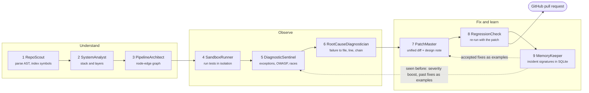

# CodeLoop

**An autonomous code-lifecycle system for Python repositories.** Point it at a git URL or a local folder and nine agents, run in sequence, take it from "something is broken" to "here is a verified pull request":

1. read the code and build a map of how data flows through it,
2. run the repo's own tests in isolation and collect every failure, security issue and race-condition risk,
3. trace each problem back to the exact line, with the call chain that reaches it,
4. have Claude write a minimal patch and a hardened-design note,
5. prove each patch on a fresh copy of the repo (tests re-run, scans re-run, anything that breaks is rejected),
6. remember the incident, so the next run flags repeats and learns from past fixes,
7. open a GitHub pull request with the accepted patches, one commit each.

Everything streams live to a React UI: a pipeline graph where failing nodes glow red, causal chains are outlined in orange and fixed nodes turn green.

> The whole project was built entirely by voice using [Wispr Flow](https://wisprflow.ai).

## The nine stages



| # | Agent | What it does |
|---|-------|--------------|
| 1 | **RepoScout** | Clones the repo (GitPython) or copies the folder, parses every Python file with `ast`, and indexes modules, classes, functions, imports and call relationships. |
| 2 | **SystemAnalyst** | Detects the stack from `requirements.txt`, `pyproject.toml` and imports (Flask, FastAPI, sqlite, threading, requests...) and classifies each module as entry, api, service, data or util. |
| 3 | **PipelineArchitect** | Builds the graph (nodes, edges, columns by layer) that the UI draws. |
| 4 | **SandboxRunner** | Runs the repo's pytest suite from a private copy, in a fresh virtualenv, with a timeout, a stripped environment and no network. |
| 5 | **DiagnosticSentinel** | Collects findings from sandbox tracebacks, a [Bandit](https://bandit.readthedocs.io) scan mapped to OWASP Top 10 (2021), and a static check for shared state modified in threaded code without a lock. Each finding gets a severity. |
| 6 | **RootCauseDiagnostician** | Maps findings to graph nodes, builds the causal chain from the entry point to the offending line, and asks Claude for a short explanation (a template is used when Claude is off). |
| 7 | **PatchMaster** | Asks Claude for a minimal unified diff plus a hardened-design paragraph, checks it with `git apply --check`, and retries once with git's error if it does not apply. |
| 8 | **RegressionCheck** | Applies each patch to a fresh copy and re-runs the tests and the scan. Compares before and after, and rejects a patch that breaks a test or adds a finding. |
| 9 | **MemoryKeeper** | Stores a signature per incident (exception type + normalized code pattern + OWASP category), the root cause, the patch and whether regression passed. |

Each stage has a status (`pending`, `running`, `success`, `failed`, `escalated`, `skipped`), a timeout and one retry. If a stage fails twice it is escalated and only the stages that depend on it are skipped.

## Quick start

You need Python 3.11+, Node 20+ and git.

**1. Backend** (FastAPI, port 8000)

```bash
cd backend
python -m venv .venv
source .venv/bin/activate          # Windows: .venv\Scripts\activate
pip install -e ".[dev]"
uvicorn app.main:app --port 8000
```

**2. Frontend** (Vite, port 5173), in a second terminal

```bash
cd frontend
npm install
npm run dev
```

**3. Open http://localhost:5173** and press **Analyze the demo app**.

The demo is [demo_target](demo_target): a small order-processing app (API, service layer, sqlite database, pytest suite) with three planted bugs: a division by zero when the quantity is zero, a SQL injection from string-formatted queries, and a race condition on a shared inventory counter. Several of its tests fail because of them.

To get patches and pull requests, set the keys before starting the backend:

```bash
export ANTHROPIC_API_KEY=sk-ant-...   # Claude explanations and patches
export GITHUB_TOKEN=ghp_...           # "Create Pull Request"
```

Without `ANTHROPIC_API_KEY` a run still completes: you get the graph, findings, root causes and causal chains, and the UI says no patch was produced. Without `GITHUB_TOKEN` the "Create Pull Request" button is disabled and says what to set.

### Creating a pull request

After RegressionCheck, the summary card has a **Create Pull Request** button. It creates the branch `codeloop/fix-{run id}`, commits the accepted patches (one commit per patch) and opens a PR whose body has the root cause, the causal chain, the before and after test results and the hardened-design notes. The link appears in the UI. Details worth knowing:

- Patches are applied to the files as they are on GitHub at the analyzed commit. If a file changed since, it stops with a clear message instead of guessing.
- The repo comes from the run's GitHub URL, or from the `origin` remote of a local folder. Otherwise set `CODELOOP_GITHUB_REPO=owner/name`.
- The token needs write access to **Contents** and **Pull requests** on the target repo.
- Clicking again returns the same PR; an existing `codeloop/fix-...` branch with no PR is never overwritten.

## Environment variables

All are optional.

| Variable | Default | Purpose |
|----------|---------|---------|
| `ANTHROPIC_API_KEY` | none | Credentials for Claude (root-cause explanations and patches). Read by the Anthropic SDK. |
| `CODELOOP_LLM` | `on` | `off` never sends repository code to the API; templates are used and no patches are made. |
| `CODELOOP_LLM_MODEL` | `claude-opus-5-5` | Model used by RootCauseDiagnostician and PatchMaster. |
| `GITHUB_TOKEN` | none | Enables **Create Pull Request**. Read per request, never stored or logged. |
| `CODELOOP_GITHUB_REPO` | detected | `owner/name` of the repo to open the PR in, overriding detection. |
| `GITHUB_API_URL` | `https://api.github.com` | GitHub API base URL, for GitHub Enterprise (or a test double). |
| `CODELOOP_MEMORY` | `on` | `off` stops reading and writing the incident memory. |
| `CODELOOP_MEMORY_DB` | `~/.codeloop/memory.db` | Where the SQLite incident memory lives. |
| `CODELOOP_WORKSPACE_DIR` | system temp `/codeloop/runs` | Where runs clone or copy repos. |
| `CODELOOP_SANDBOX_PYTHON` | a fresh virtualenv per run | Run sandboxed tests with this interpreter instead (faster, less isolated). Mostly for tests. |
| `CODELOOP_ALLOW_WRITE` | none | Extra directories the sandboxed tests may write to (path-separator separated). |
| `CODELOOP_CORS_ORIGINS` | `http://localhost:5173` | Comma-separated origins the API accepts. |
| `CODELOOP_BACKEND` | `http://127.0.0.1:8000` | Frontend dev server: where `/api` is proxied. |
| `VITE_API_BASE` | `/api` | Frontend: call a backend directly instead of through the proxy. |

## Safety notes

- **Sandbox.** Target tests run in a fresh virtualenv from a private copy, with a timeout, a stripped environment (no credentials), proxies pointed at a dead port, and an in-process guard against non-loopback sockets and writes outside the copy. This is best-effort subprocess isolation, not a security boundary: installing a repo's dependencies runs their build scripts, and a determined test can step around the guard. Only analyze code you are willing to run. A container mode is not implemented.
- **Code leaves your machine** only to the Anthropic API, and only when Claude is on. Set `CODELOOP_LLM=off` to prevent that.
- **Credentials in clone URLs** are redacted everywhere they are shown or stored.
- **Pull request text** written by a model is escaped, so it cannot inject HTML, mentions or links.
- Targets are Python repositories only.

## How it learns

Every finding in application code gets a signature. When a later run hits the same signature, its node shows a **seen before** badge and its severity is raised one level. PatchMaster shows Claude the accepted, regression-passing fixes for similar signatures as examples. The **History** tab lists every remembered incident, its outcome and its patch.

## API

| | |
|---|---|
| `POST /runs` | Start a run from `{ "source": "<git url or local path>" }`. Returns the run id. |
| `WS /ws/runs/{id}?since=N` | Status changes and log lines, replayed from event `N`. |
| `GET /runs/{id}` | Run summary and per-stage status. |
| `GET /runs/{id}/graph` | The pipeline graph, with finding and fixed overlays. |
| `GET /runs/{id}/diagnostics` | Findings and root causes with causal chains. |
| `GET /runs/{id}/patches` | One patch per root cause, with before and after files. |
| `GET /runs/{id}/regression` | Verdict per patch and the before/after summary. |
| `GET, POST /runs/{id}/pull-request` | Whether a PR can be created, and creating it. |
| `GET /memory/incidents` | The incident history. |
| `GET /environment` | What this server has switched on. |

## Development

```bash
# backend
cd backend && pytest                   # ~100 s; includes the GitHub flow against an in-memory fake GitHub

# frontend
cd frontend && npm test && npm run build
```

The tests never call the Anthropic API or GitHub: `CODELOOP_LLM` is forced off and GitHub traffic goes to a local fake server.

```
backend/app/
  agents/          the nine agents and their helpers
  api/             REST routes (runs, memory, pull requests, environment)
  models/          Pydantic contracts for every agent's input and output, plus RunContext
  orchestrator/    runs the agents in order: timeouts, retry, escalation, event stream
  sandbox.py       isolated test execution
  github_pr.py     branch, commits and pull request through PyGithub
  memory.py        SQLite incident memory
frontend/src/      React + Vite + TypeScript, React Flow graph, Monaco diff editor
demo_target/       the demo app with three planted bugs
```
